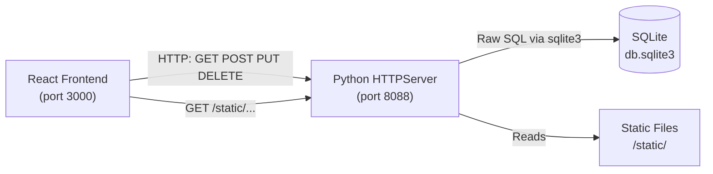
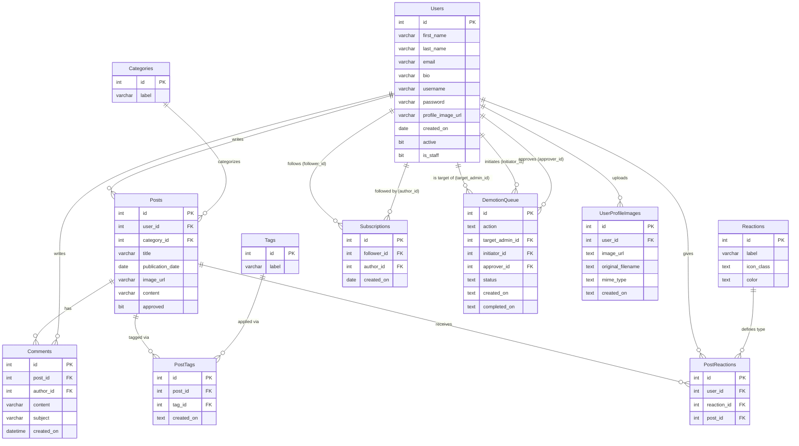

<!-- Last updated: 2026-05-03 -->
<!-- Last change: Initial architecture document -->

# Rare - Technical Architecture

## System Overview

Rare is a locally-hosted REST API that serves a paired React frontend client. The backend
is a single-process Python HTTP server (with threading) that routes requests by resource
name, executes raw SQL against a SQLite database file, and returns JSON responses. There is
no framework, no ORM, and no external services.



## Codebase Map

```text
Rare-for-Python-api-fljqvv/
├── json-server.py              # Entry point: starts server, owns all routing logic
├── nss_handler.py              # Base handler class: URL parsing, CORS, response helpers
├── helpers.py                  # General utilities (URL validation)
├── db.sqlite3                  # SQLite database file
├── loaddata.sql                # Schema DDL and seed data (source of truth for schema)
├── Pipfile                     # Python deps: pylint, autopep8
│
├── views/                      # One module per resource; each exports CRUD functions
│   ├── __init__.py             # Re-exports all view functions for use in json-server.py
│   ├── posts.py                # CRUD for Posts
│   ├── posts_helpers.py        # Dynamic query builder and row mapper for Posts
│   ├── categories.py           # CRUD for Categories
│   ├── comments.py             # CRUD for Comments
│   ├── comment_helpers.py      # Helper utilities for Comments
│   ├── tags.py                 # CRUD for Tags
│   ├── reactions.py            # GET all and POST for Reactions
│   ├── postreactions.py        # Create/update PostReactions (upsert pattern)
│   ├── posttags.py             # CRUD for PostTags
│   ├── posttags_helpers.py     # Helper utilities for PostTags
│   ├── subscriptions.py        # Create, list, and delete Subscriptions
│   ├── users.py                # Register, login, get, and update Users
│   ├── user_helpers.py         # Row serializer and query builder for Users
│   ├── avatars.py              # Serve pre-seeded avatar list from static directory
│   ├── profile_images.py       # Save and retrieve uploaded profile image metadata
│   ├── demotionqueue.py        # CRUD for DemotionQueue entries
│   └── demotionqueue_helpers.py # Helper utilities for DemotionQueue
│
└── static/
    ├── avatars/                # Pre-seeded avatar images served to clients
    └── uploads/users/          # User-uploaded profile images, organized by user ID
```

## Entry Points

**Server startup:**
`json-server.py` > `main()` > `ThreadedHTTPServer(("", 8088), JSONServer).serve_forever()`

`ThreadedHTTPServer` combines Python's `HTTPServer` and `ThreadingMixIn`, so each incoming
connection is handled in its own thread.

**Request lifecycle:**

1. A request arrives on port 8088 and Python's `HTTPServer` dispatches it to `JSONServer`.
2. `JSONServer` inherits from `HandleRequests` (in `nss_handler.py`), which provides
   `parse_url()`. This returns a dictionary:

   ```python
   {
       "requested_resource": "posts",   # first path segment
       "pk": 3,                         # integer id if present, else 0
       "query_params": {"_expand": ["category"]}  # {} if none
   }
   ```

3. The appropriate `do_GET`, `do_POST`, `do_PUT`, or `do_DELETE` method runs and walks an
   `if/elif` chain on `requested_resource` to call the matching view function.
4. The view function opens a SQLite connection, runs parameterized SQL, builds a Python
   dict or list, and returns `json.dumps(result)`.
5. The router receives the JSON string, optionally parses it to check for an `"error"` key,
   and calls `self.response(body, status_code)` to write the HTTP response.

**Static file requests** bypass routing entirely: `serve_static_file()` is checked first in
`do_GET`. Any path starting with `/static/` is resolved to a file on disk and streamed
directly. Directory traversal is blocked.

## Component Breakdown

### HandleRequests (`nss_handler.py`)

Base class that all request handling inherits from. Provides:

- `parse_url()`: splits a raw path into resource name, primary key, and query params.
- `response()`: writes the HTTP status, content-type headers, and response body.
- `set_response_code()`: sets status and CORS headers (`Access-Control-Allow-Origin: *`).
- `do_OPTIONS()`: handles CORS preflight requests from the browser.
- `validate_required_fields()`: returns an error response if a required key is absent from
  the request body, keeping validation consistent across endpoints.

### JSONServer (`json-server.py`)

The main server class. It is responsible for all routing. Every resource has a block in the
appropriate `do_*` method. It also owns:

- Multipart profile image upload handling (`handle_profile_image_upload()`).
- Static file serving (`serve_static_file()`).
- URL validation for `image_url` fields on posts (delegates to `helpers.is_valid_url()`).

### Views (`views/`)

Each file handles one resource. Functions follow a consistent pattern:

1. Open a `sqlite3` connection using a context manager.
2. Set `conn.row_factory = sqlite3.Row` for column-name access on result rows.
3. Execute a parameterized SQL query.
4. Build a Python dict or list from the rows.
5. Return `json.dumps(result)`.

Helper files (`*_helpers.py`) are used when query construction or row serialization is
complex enough to warrant extraction (dynamic `_expand` joins on posts, for example).

## Data Model

### Schema

| Table | Key Columns | Notes |
| --- | --- | --- |
| `Users` | id, first_name, last_name, email, username, password, is_staff, active | Passwords stored as plaintext (learning project; not for production) |
| `Posts` | id, user_id, category_id, title, publication_date, image_url, content, approved | `approved=0` hides a post from the public feed |
| `Categories` | id, label | Each post belongs to exactly one category |
| `Comments` | id, post_id, author_id, content, subject, created_on | `author_id` references `Users.id` |
| `Tags` | id, label | |
| `PostTags` | id, post_id, tag_id, created_on | UNIQUE(post_id, tag_id); indexed on both FKs |
| `Reactions` | id, label, icon_class, color | Font Awesome class name and hex color; pre-seeded |
| `PostReactions` | id, user_id, reaction_id, post_id | UNIQUE(user_id, post_id) enforces one reaction per user per post |
| `Subscriptions` | id, follower_id, author_id, created_on | Both columns reference `Users.id` |
| `DemotionQueue` | id, action, target_admin_id, initiator_id, approver_id, status, created_on, completed_on | Tracks two-admin approval workflow for demotion |
| `UserProfileImages` | id, user_id, image_url, original_filename, mime_type, created_on | Metadata for uploaded images; actual file stored on disk |

### Entity Relationship Diagram



## API Design

### URL Pattern

```text
GET    /posts           # list all (approved, sorted newest first)
GET    /posts/3         # single resource by id
GET    /posts?user_id=1 # filter by foreign key
POST   /posts           # create
PUT    /posts/3         # full update (all fields required)
DELETE /posts/3         # delete by id
```

### `_expand` Query Parameter

Several GET endpoints accept `?_expand=<resource>` to JOIN related data into the response.
This naming convention mirrors json-server.js, which the NSS curriculum uses in the
JavaScript portion.

Supported combinations:

- `GET /posts?_expand=category` - includes full category object on each post
- `GET /posts/{id}?_expand=category,user` - includes category and user objects
- `GET /comments?post_id={id}&_expand=user` - includes author on each comment

### Authentication Pattern

`POST /login` returns `{"valid": true, "token": <user_id>}` on success. The "token" is the
user's integer database ID. The frontend stores this and includes the user's ID on requests
that need it (e.g., creating a post). The backend does not validate an auth token on
incoming requests; it trusts the `user_id` values sent by the client.

`POST /register` returns the same shape, so the client can log the user in immediately
after registration.

### Error Responses

All errors are returned as `{"error": "<message>"}` with an appropriate HTTP status code:

- `400` for missing required fields or invalid input
- `404` for resources not found
- `204` for successful deletes (no body)

### Endpoints Summary

| Method | Path | Description |
| --- | --- | --- |
| POST | /login | Authenticate user |
| POST | /register | Create user account |
| GET/PUT | /users | List all (filter by active) |
| GET/PUT | /users/{id} | Get or update user |
| GET/POST | /posts | List approved posts or create |
| GET/PUT/DELETE | /posts/{id} | Get, update, or delete post |
| GET | /posts?user_id={id} | Posts by a specific user |
| GET/POST | /categories | List all or create |
| GET/PUT/DELETE | /categories/{id} | Get, update, or delete |
| GET/POST | /comments | Get by post_id or create |
| GET/PUT/DELETE | /comments/{id} | Get, update, or delete |
| GET/POST | /tags | List all or create |
| GET/PUT/DELETE | /tags/{id} | Get, update, or delete |
| GET/POST | /reactions | List all or create |
| GET/POST/PUT | /postreactions | List (filter by post_id), create, or update |
| GET/POST/DELETE | /subscriptions | List all, create, or delete |
| GET/POST/DELETE | /posttags | List all, create, or delete |
| GET/POST/PUT/DELETE | /demotionqueue | Full CRUD with filter support |
| GET | /avatars | List pre-seeded avatars |
| GET/POST | /profile-images | Get by user_id or upload (multipart) |
| GET | /static/* | Serve static files from disk |

## Infrastructure & Deployment

- **Environment:** Local development only. The server runs on `localhost:8088`.
- **Threading:** `ThreadingMixIn` allows multiple concurrent requests, each handled in its
  own thread. The SQLite connection-per-request pattern is safe under this model because
  each thread opens and closes its own connection via context manager.
- **CORS:** All origins are allowed (`Access-Control-Allow-Origin: *`). This is appropriate
  for a local development project where the React client runs on a different port.
- **No deployment pipeline:** There is no CI/CD, no containerization, and no remote hosting.
  The project runs entirely on developer machines.

## Key Technical Decisions

- **No web framework:** Using `http.server` directly forces students to implement routing,
  request parsing, and response formatting by hand, exposing how HTTP actually works.
- **No ORM:** Raw SQL reinforces relational database concepts that would otherwise be
  abstracted away. Every query is explicit.
- **SQLite file database:** Zero configuration, no server to run. Appropriate for a local
  curriculum project. The database is created and seeded by running `loaddata.sql`.
- **JSON string convention:** All view functions return `json.dumps(result)` strings (not
  dicts). The router in `json-server.py` receives these strings, optionally parses them to
  check for `"error"` keys, and writes them to the HTTP response body directly.
- **"Token" as user ID:** Login returns the user's integer database ID as the "token". This
  is a simplified stand-in for real auth; the server does not verify tokens on requests.
- **One reaction per user per post:** Enforced by a `UNIQUE(user_id, post_id)` index in the
  database rather than application logic, making it reliable regardless of how requests
  arrive.
- **Admin demotion queue:** Rather than allowing any admin to directly demote another, a
  two-admin approval workflow was implemented. A second admin must approve the demotion
  before it takes effect.

## Project Conventions

### Code Style

- `pylint` and `autopep8` are used for linting and formatting (configured via Pipfile).
- View functions are named with snake_case verbs: `get_all_posts`, `create_post`,
  `update_post`, `delete_post`.
- Each resource has its own file in `views/`. If query construction or row mapping grows
  complex, a `*_helpers.py` file is added alongside it.

### Database Access Pattern

- Always use the context manager: `with sqlite3.connect("./db.sqlite3") as conn:`
- Always set `conn.row_factory = sqlite3.Row` for named column access.
- Always use parameterized queries (`?` placeholders). Never format user input into a
  query string directly.

### Error Handling

- View functions signal errors by returning `json.dumps({"error": "..."})`.
- The router (in `json-server.py`) parses the response to detect errors and maps them to
  the appropriate HTTP status code.
- View functions do not raise exceptions for expected conditions (not found, constraint
  violation). They return error dicts instead.

### Commits and PRs

- The project uses the `pull_request_template.md` at the project root for all PRs.
- Work was organized in weekly sprints using a kanban board. Each ticket was picked from
  the shared backlog at sprint start.
